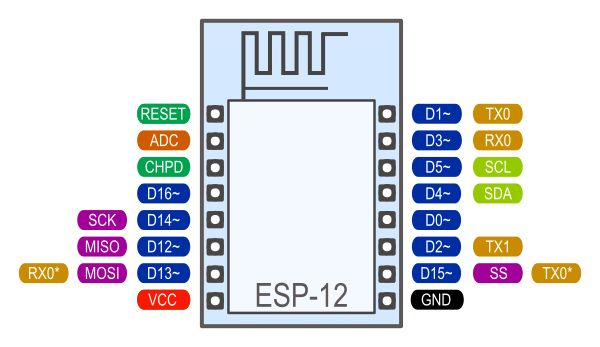
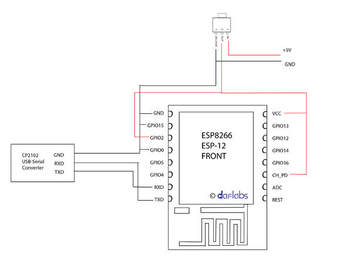

# esp8266-12

## adaptor:

- Reserved LDO place on the back of board

- 10K resistor between CHPD and VCC, to enable chip

- 10K resistor between GPIO2 and GND

- GPIO15 to GND for normal flash boot mode

## schema-programare:

VCC ----> 3.3V Power supply (Vout of LM1117)

GND ----> Ground of power supply

CH_PD ----> HIGH (3.3V)

GPIO2 ----> HIGH (3.3V)

GPIO15 ----> LOW (GND)

[Comenzi AT](https://room-15.github.io/blog/2015/03/26/esp8266-at-command-reference/)

**AT+GMR** - returneaza versiunea firmware: 0018000902-AI03

Upload new firmware